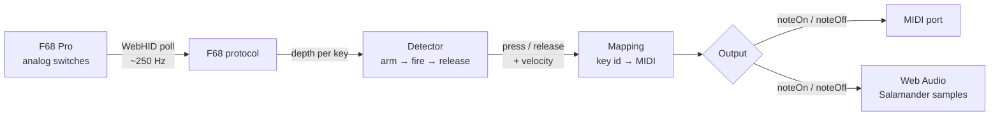
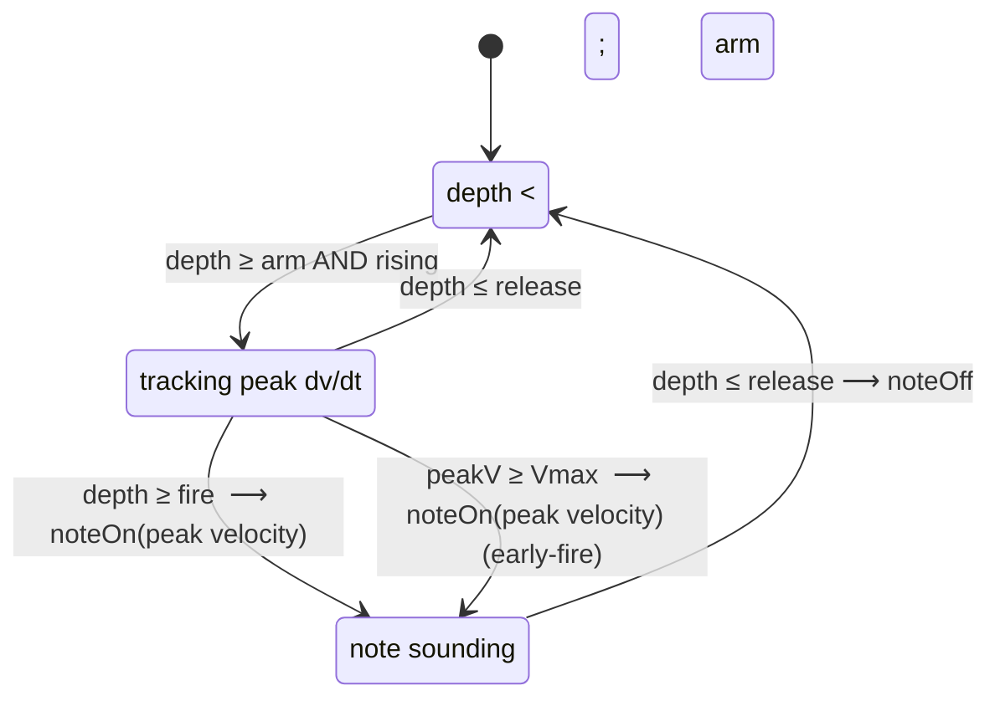
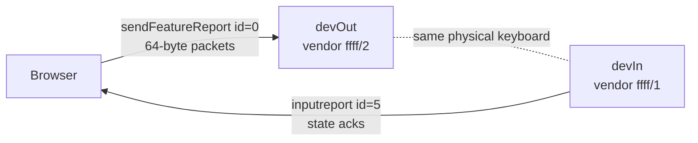
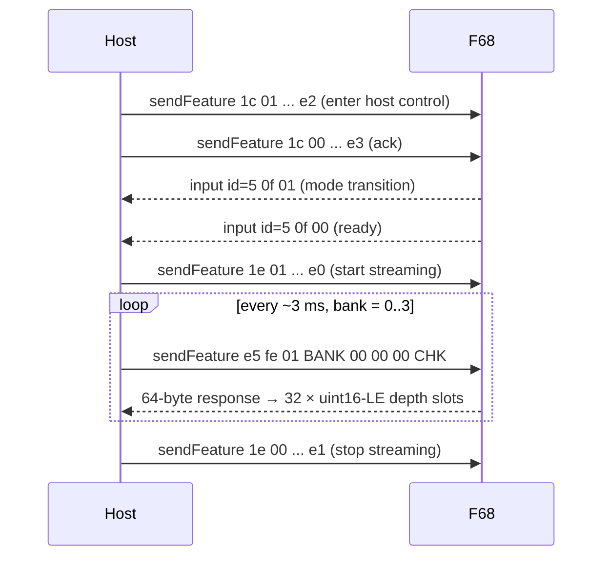

# keyclave

Browser-based velocity-sensitive keyboard for the **FREE WOLF F68 Pro** magnetic
(Hall-effect) keyboard. Reads analog key depth straight off the device via
WebHID, turns presses into MIDI or piano samples — no driver, no DAW required.

> **Origin.** Picked up a FREE WOLF F68 Pro on a [really good
> AliExpress deal](https://www.aliexpress.com/w/wholesale-free-wolf-f68-keyboard.html),
> realised magnetic switches stream a continuous depth value per key, and went
> down the rabbit hole. **Analog keys are fun.**

```
keyclave/
├── clave.html         — MIDI output + sampler scaffold
├── clave-piano.html   — direct piano sampler with sustain pedal
└── README.md
```

### Data flow



## Requirements

- Chrome / Edge (any Chromium browser — WebHID is required).
- A FREE WOLF F68 Pro magnetic-switch keyboard (VID 0x3151, PID 0x5029).
- For MIDI mode in `clave.html`: a MIDI receiver — on macOS enable the **IAC
  Driver** in Audio MIDI Setup and point your DAW at it.

## Usage

Open the file in Chrome (works straight from `file://`), then:

1. **Connect keyboard** — Chrome's HID picker will show two entries for
   FREE WOLF F68 (two vendor collections). **Select both** (Cmd/Ctrl-click).
2. The page runs the F68's enable-streaming handshake automatically.
3. Press keys. Calibrated keys play; uncalibrated keys are ignored (you'll
   see them in the log).

### Tuning controls

- **Arm** depth (default 60) — start tracking velocity once depth crosses this.
- **Fire** depth (default 280) — at this depth the note triggers; the velocity
  used is the **peak rise rate** observed during the rise.
- **Release** depth (default 30) — drop below this to end the note.
- **Vmax** (default 12) — peak dv/dt that maps to MIDI velocity 127. Hard hits
  faster than this fire *early* (before reaching Fire depth) for lower latency.

Per-key state machine:



### Calibration

The default mapping covers 24 keys → MIDI 48–71 (C3–B4), tuned for the
QWERTY-style layout. To remap:

1. Click **Start** in Calibration. Set the starting MIDI note (default 48 = C3).
2. Toggle **chromatic** off if you only want white keys.
3. Press each physical key in order. Use **Skip** / **Undo** as needed.
4. Click **Done**. The mapping auto-saves to `localStorage`.
5. **Save JSON** to keep a portable copy; **Load JSON** to restore one.

## `clave-piano.html` extras

- Uses the **Salamander Grand Piano** samples served from
  [`https://tonejs.github.io/audio/salamander/`](https://tonejs.github.io/audio/salamander/).
  30 samples every 3 semitones; intermediate notes are detuned via
  `playbackRate`. Samples are cached by the browser after first load.
- **Sustain pedal**: click **Set sustain key**, then press the physical key
  you want as the pedal (the F68's spacebar works well). Holding it defers
  releases; lifting it dampens all held notes.
- Adjustable **release tail** (envelope decay length) and **volume**.

## Adding outputs

`clave.html` has an `Output` base class. Subclass it, then register in
`outputFor()` and add a `<option>` to the mode select:

```js
class MyOutput extends Output {
  constructor() { super('my'); }
  async start()       { /* set up backend */ }
  async stop()        { /* tear down */ }
  noteOn(midi, vel)   { /* play */ }
  noteOff(midi)       { /* stop */ }
}
// in outputFor():
if (mode === 'my') return new MyOutput();
```

## Protocol notes (FREE WOLF F68 Pro)

Discovered by sniffing [iotdriver.qmk.top](https://iotdriver.qmk.top) with a
WebHID overlay that monkey-patches `navigator.hid` to log every
`sendFeatureReport` / `receiveFeatureReport` / `inputreport` call.

The F68 Pro presents itself as **two HID interfaces** — both must be opened:



All command packets are 8 meaningful bytes + 56 zeros, padded to 64. Byte 7 is
a checksum: `0xff − sum(byte[0..6])`. The enable handshake:



Response layout: 64 bytes = 32 little-endian 16-bit slots. Each slot holds the
current depth for one key (0 = released, ~355 = bottomed out). Global key id =
`bank * 32 + slot`.

Streaming mode suspends normal HID keystroke reporting — the keyboard becomes a
pure analog-streaming device until `1e 00` is sent. (This is why DOM `keydown`
for Space can't drive the sustain pedal; the assignment uses an analog-stream
key id instead.)

## License

This project lives next to other personal experiments. No license claimed.
Piano samples are from the [Salamander Grand Piano V3 project](https://archive.org/details/SalamanderGrandPianoV3),
licensed CC-BY 3.0 — credit Alexander Holm if you redistribute.
