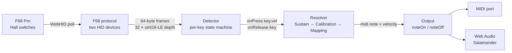

# architecture

How the two HTML files are structured, and how a key press becomes a sound.

## Same 8 sections in both files

`clave.html` and `clave-piano.html` are self-contained, no shared file. They mirror each other's structure — comment banners number the sections identically. When you change protocol or detector logic, **apply the change to both and diff to confirm**.

```
1. Default mapping       — physical key id → MIDI note (bundled defaults)
2. Utilities             — $, log, midiName, isWhite, clamp, hex
3. Mapping module        — load/save/clear, syncs to localStorage
4. Output abstraction    — clave.html: Output base + MidiOutput + SamplerOutput
                           clave-piano.html: single Piano sampler, no abstraction
5. F68 HID protocol      — connect, enable handshake, poll loop
6. Detector              — frame parser → press/release callbacks
7. Calibration           — next-press-records-mapping flow
8. UI wiring             — button handlers + Detector.onPress/onRelease
```

## End-to-end data flow



The F68 streams analog depth values; the Detector decides when those values constitute a press or release; the resolver picks the right action (sustain capture → calibration record → mapping lookup); the active Output produces sound or sends MIDI.

## Deployment

There is no build, no server, no dependencies. Open `clave.html` or `clave-piano.html` straight from `file://` in Chrome. The dev loop is edit → reload tab → press keys. State (mapping, sustain key) lives in `localStorage`. Sample audio for the piano is fetched from `https://tonejs.github.io/audio/salamander/` and cached by the browser.

## Important non-obvious wiring

- The F68 presents two HID interfaces, **both must be opened**. Commands go on one; mode acks come on the other. See the `f68-protocol` card.
- `Detector.onPress` / `onRelease` are nullable callbacks. Subscribers should be ready for `releaseAll()` calls during shutdown.
- During streaming, the F68 **stops sending normal HID keystrokes**, so DOM `keydown` is unavailable for any UI driven by physical keys (see `sustain-pedal`).
- Mutations to the mapping must go through `Mapping.set` / `remove` / `clearAll` / `resetToDefault` — those call `save()` which writes localStorage *and* re-renders the UI. Don't poke `Mapping.table` directly.
