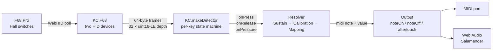

# architecture

How the project is structured, and how a key press becomes a sound.

## Three files

```
keyclave.js        — reusable layer.  HID protocol, Detector factory,
                     Mapping factory, utilities.  Plain non-module script;
                     attaches a single `KC` global.
clave.html         — MIDI + sampler frontend.  Loads keyclave.js, defines
                     the Output abstraction (MidiOutput, SamplerOutput),
                     calibration UI, aftertouch controls.
clave-piano.html   — Salamander grand frontend.  Loads keyclave.js, has a
                     direct Web Audio Piano object instead of an Output
                     abstraction, plus the spacebar-style sustain pedal.
```

`keyclave.js` is loaded with a classic `<script src="keyclave.js"></script>`
so `file://` keeps working. No build step, no module loader.

The two HTML frontends share **zero code** at runtime — both just use `KC`.
They also share zero HTML/CSS structurally beyond the section conventions.

## End-to-end data flow



The F68 streams analog depth values; the Detector decides when those values constitute a press, release, or aftertouch update; the resolver picks the right action (sustain capture → calibration record → mapping lookup); the active Output produces sound or sends MIDI.

## Deployment

There is no build, no server, no dependencies. Open `clave.html` or `clave-piano.html` straight from `file://` in Chrome. The dev loop is edit → reload tab → press keys. State (mapping, sustain key) lives in `localStorage`. Sample audio for the piano is fetched from `https://tonejs.github.io/audio/salamander/` and cached by the browser.

## Important non-obvious wiring

- The F68 presents two HID interfaces, **both must be opened**. Commands go on one; mode acks come on the other. See the `f68-protocol` card.
- `Detector.onPress` / `onRelease` / `onPressure` are nullable callbacks. Set the ones the consumer needs; leave the others null to skip the work.
- `Detector.releaseAll()` is called on shutdown to clear stuck notes; subscribers should be ready for it.
- During streaming, the F68 **stops sending normal HID keystrokes**, so DOM `keydown` is unavailable for any UI driven by physical keys (see `sustain-pedal`).
- Mutations to the mapping must go through `Mapping.set` / `remove` / `clearAll` / `resetToDefault` / `replace` — they call `save()` which writes localStorage and runs the consumer's `onChange` (so the UI re-renders). Don't poke `Mapping.table` directly.
- `KC.makeMapping({ storageKey, defaults, onChange })` and `KC.makeDetector({ getThresholds, callbacks })` are factories: a consumer page can have multiple independent mappings or detectors if it ever needs them.
