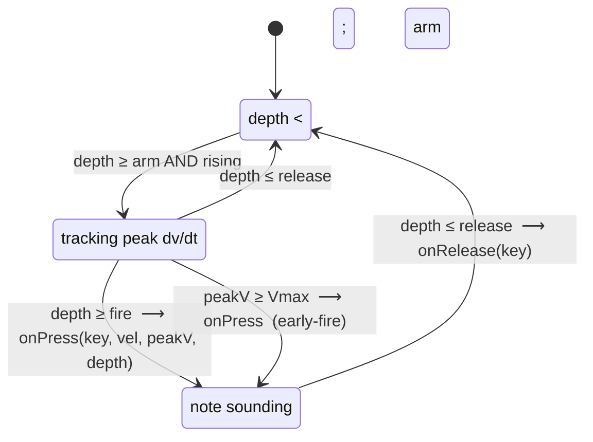

# detector

Per-key state machine that turns raw depth frames into press/release events with peak velocity. Section 6 of both HTML files; the `Detector` object.

## State machine



Three thresholds and one velocity ceiling drive everything:

- **arm** (default 60) — depth at which the key is considered "starting to press". Below this we don't track velocity.
- **fire** (default 280) — depth at which `onPress` actually fires. Default is close to bottom-out (~355) so the velocity used reflects the *whole* travel, not a sample near the trigger.
- **release** (default 30) — depth at which the note ends.
- **Vmax** (default 12 units/ms) — peak rise rate that maps to MIDI velocity 127. Hard hits that reach `Vmax` fire *immediately* (before depth reaches `fire`) so very-fast taps aren't penalised by the wait-for-bottom-out policy.

## Velocity

Velocity is the **peak `dv/dt` observed during the rise**, scaled linearly:

```
midi_vel = clamp(1, 127, round((peakV - 0.4) / (Vmax - 0.4) * 107 + 20))
```

Both `peakV` is in units/ms (depth is 0–355, dt is milliseconds).

**Critical invariant**: `lastT[key]` is updated **every frame**, including idle frames. An earlier version only updated it when `(d || p) > 0`, which meant a press fast enough to go 0 → 355 inside one poll cycle (~12 ms) saw `lt = 0` on the first nonzero sample, computed `dv = 0`, and never grew `peakVel` past zero. Result: hard hits registered as MIDI velocity 13. The fix is to set `this.lastT[key] = now` unconditionally.

## Callback contract

Consumers wire into:

```js
Detector.onPress   = (key, midiVel, peakV, depth) => { ... }
Detector.onRelease = (key) => { ... }
```

- Callbacks are nullable; the Detector guards each call with `&& this.on...`.
- `Detector.releaseAll()` invokes `onRelease` for every currently-on key — call it on shutdown so output backends can clear stuck notes.
- `key` is the global id (`bank * 32 + slot`) — banks and slots are an implementation detail of the protocol layer; consumers should treat `key` as opaque.

## Per-key arrays

Sized `NKEYS = 128`:

- `prevDepth: Int16Array` — depth seen on previous poll of this key
- `lastT: Float64Array` — timestamp of previous poll
- `peakVel: Float32Array` — peak dv/dt this press (cleared on release)
- `armed: Uint8Array` — armed but not yet fired
- `on: Uint8Array` — currently sounding

`processFrame(bank, data)` iterates `slot = 0..31`, computes `key = bank * 32 + slot`, updates state, and emits events. It does *not* track depth changes between frames of different banks (each key only updates when its own bank is polled).
