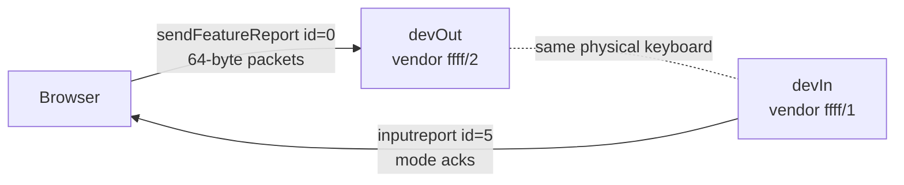
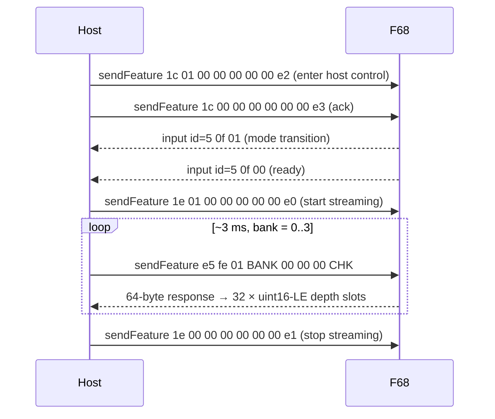

# f68-protocol

Reverse-engineered HID protocol for the FREE WOLF F68 Pro (VID `0x3151`, PID `0x5029`). Lives in section 5 of both HTML files; the `F68` object encapsulates it.

## Two HID interfaces — both must be opened

The keyboard exposes itself as two WebHID devices. The chooser shows two entries for the same name; users **must select both** (Cmd/Ctrl-click in Chrome's picker).



`F68.connect()` picks each device by descriptor — `devOut` is whichever has a non-empty `featureReports` on its vendor collection, `devIn` is whichever declares `inputReports[reportId=5]`. Opening only one yields a working-looking page that returns all-zero polls and no mode acks.

## Packet format

All commands are 64-byte feature reports (padded with zeros). Only the first 8 bytes are meaningful; **byte 7 is a checksum**:

```
byte[7] = (0xff - sum(byte[0..6])) & 0xff
```

`F68.pkt(...bytes)` builds these.

## Enable / disable / poll



`F68.enable()` waits for the `0f 01` and `0f 00` input reports after sending `1c 00` — without the wait, the device often hasn't completed the mode transition and the first `1e 01` is dropped. `F68.disable()` sends `1e 00` on shutdown.

## Poll response layout

Each 64-byte response from a `e5 fe 01 BANK ...` request is **32 little-endian uint16 slots**:

- `slot[i]` lives at bytes `[i*2, i*2 + 1]`.
- Value is the per-key depth: `0` = released, ~`355` = bottomed-out.
- **Global key id = `bank * 32 + slot`**, so each bank gives 32 keys and the 4-bank round-robin covers up to 128 keys.

During streaming the keyboard suspends normal HID keystroke reporting. To restore normal typing, send `1e 00` (or unplug/replug).

## Polling loop characteristics

- `F68.startPolling(onFrame)` runs while `polling && devOut.opened`.
- Loop pacing: `await new Promise(r => setTimeout(r, 2))` between polls → ~250 Hz aggregate, ~80 Hz per key (each key only sampled when its bank is active).
- Errors are tolerated with exponential backoff: up to 8 consecutive failures before giving up. Chrome's `receiveFeatureReport` can transient-fail on USB stalls; a single failure does *not* mean the connection is dead.

## Recovery / new keyboards

When the firmware changes or another magnetic keyboard appears, the procedure used to bring this up:

1. Open the vendor's web configurator (e.g. `iotdriver.qmk.top`).
2. Run `backup/sniffer.js` in DevTools — it monkey-patches `navigator.hid` to log every `sendFeatureReport` / `receiveFeatureReport` / `inputreport`.
3. Use the configurator's UI; press a few keys.
4. `__hidSniffer.dump()` → inspect the JSON for the enable command(s), the response layout, any per-key mapping.
5. Update `F68.enable()` / `F68.startPolling()` accordingly. Don't forget the checksum.
