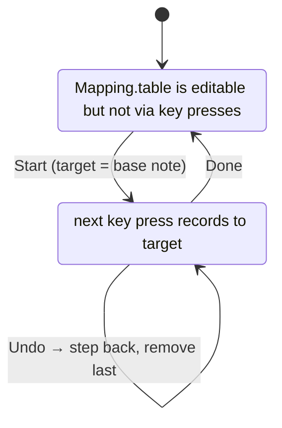

# mapping

Physical key id (`bank * 32 + slot`) → MIDI note table. Persisted to `localStorage` under key `clave-map`, editable via the calibration UI. Section 3 of both HTML files; the `Mapping` object.

## Default mapping

24 keys, chromatic C3–B4 (MIDI 48–71), inlined as `DEFAULT_MAPPING` at the top of each file. Loaded into `Mapping.table` on first run; subsequent loads pull from localStorage. **Reset to default** restores the bundled table.

The defaults correspond to a comfortable two-octave layout on the F68's home rows; mileage varies by physical board and finger preference, hence calibration.

## Invariants

- **Always mutate through `Mapping.set(key, midi)` / `Mapping.remove(key)` / `Mapping.clearAll()` / `Mapping.resetToDefault()`.** Each calls `Mapping.save()`, which writes localStorage *and* re-renders the mapping table in the UI. Direct `Mapping.table[k] = ...` skips both.
- Keys are stored as **string** properties on the table object (JSON-serialisable). Lookups via `Mapping.has(key)` and `Mapping.get(key)` coerce numbers to strings via the `in` operator and bracket indexing.
- Multiple physical keys can map to the same MIDI note; the calibration helper removes the prior mapping of that note before recording a new one, so a note has at most one physical key by the end of a clean calibration pass.

## Calibration flow



UI element wiring:

- **Start** — `Calibration.active = true`, `target = base-note input`. If "chromatic" is off and `target` is a black key, advances past it.
- **Skip** — `advance(+1)` (or to next white key when chromatic is off).
- **Undo** — `advance(-1)` and remove any mapping currently pointing to that target.
- **Done** — `active = false`. Mapping persists.
- **Clear all** / **Reset to default** — wipes or restores `Mapping.table`, both confirm-protected.
- **Save JSON** / **Load JSON** — portable export/import using the same `{ [key]: midi }` shape.

## Calibration interception

In `Detector.onPress`, the calibration check fires *after* the sustain-pedal check (so the assigned sustain key never accidentally gets calibrated) and *before* the mapping lookup. While `Calibration.active`, the press records the mapping and returns — no MIDI fires during calibration. Releases during calibration are ignored.

## JSON format

The export format is a flat object:

```json
{
  "2": 48,
  "7": 49,
  "8": 50
}
```

Keys are stringified physical-key ids; values are MIDI note numbers (0–127). Load JSON replaces the entire table; merge isn't supported.
