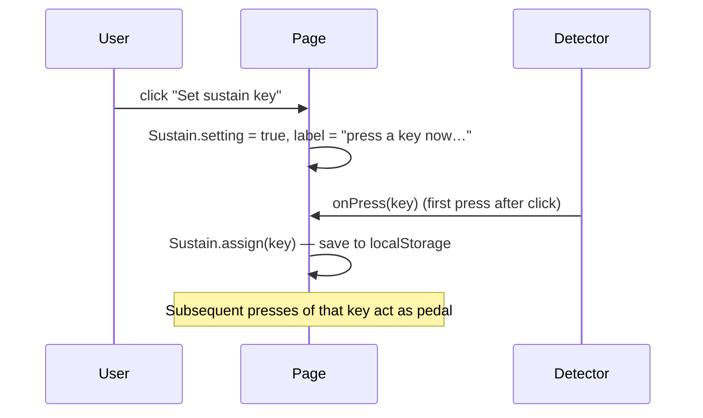

# sustain-pedal

(`clave-piano.html` only) Lets the user designate one physical key on the F68 as a sustain pedal. While that key is held, key releases are *deferred* — notes ring through the rest of the release tail until the pedal lifts, at which point all held notes damp. Models the right-hand damper pedal on an acoustic piano.

## Why DOM `keydown` doesn't work

A natural-feeling implementation would be `window.addEventListener('keydown', e => e.code === 'Space' ...)`. It doesn't work here because **the F68 stops emitting normal HID keystrokes while it's in analog-streaming mode**. From the OS's perspective the keyboard is just streaming raw depth values; no `keydown` ever fires.

So the sustain key has to come from the same source as note keys: the analog poll stream itself.

## Assignment flow



Assignment persists across reloads under `localStorage['clave-sustain-key']`. **Clear** removes it.

## Behaviour

`Sustain` keeps three pieces of state:

- `key: number | null` — assigned physical key id
- `active: bool` — pedal currently held
- `held: Set<midi>` — notes whose physical key was released while the pedal was active

The check order in `Detector.onPress` is **sustain first, then calibration, then mapping**:

```js
Detector.onPress = (key, vel, peakV, depth) => {
  if (Sustain.setting)        { Sustain.assign(key); return; }   // capturing assignment
  if (key === Sustain.key)    { Sustain.set(true); return; }     // pedal pressed
  if (Calibration.active)     { Calibration.record(key); return; }
  if (!Mapping.has(key))      return;
  /* play */
};
```

Release mirror:

```js
Detector.onRelease = (key) => {
  if (key === Sustain.key)    { Sustain.set(false); return; }
  if (Calibration.active)     return;
  if (!Mapping.has(key))      return;
  const midi = Mapping.get(key);
  if (Sustain.active) Sustain.held.add(midi);      // defer release
  else { Piano.noteOff(midi); activeNotes.delete(midi); updateActive(); }
};
```

When the pedal lifts (`Sustain.set(false)`):

- Every midi in `held` is `Piano.noteOff`'d (using the normal release tail).
- `held` is cleared.

If the user **re-presses** a sustained note while the pedal is still down, `Detector.onPress` removes the midi from `held` *before* calling `Piano.noteOn` — that note is now "physically held", not "sustained". `Piano.noteOn` internally cuts the previous voice and starts fresh, matching acoustic-piano behaviour (re-strike with damper still up).

## Piano-pedal mental model

- **Pedal down = dampers off all strings**. Strings ring freely; released keys keep sounding.
- **Pedal up = dampers fall back**. Each released string damps.

Counter-intuitively, "pressing the pedal" *removes* damping. The implementation matches: `Sustain.set(true)` defers `noteOff`; `Sustain.set(false)` issues them.
